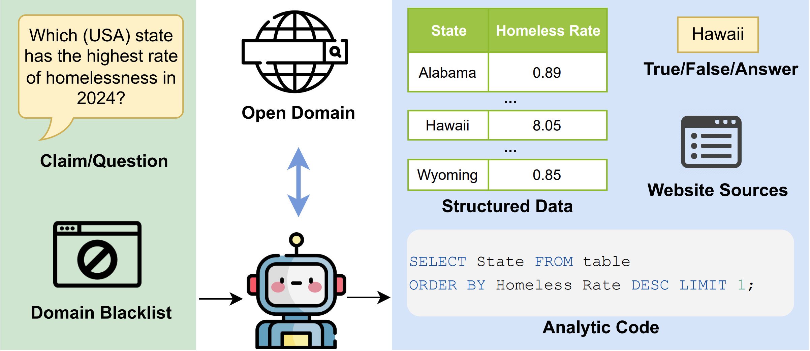

# 🎭 DRAMA: Unifying Data Retrieval and Analysis for Open-Domain Queries

This repository contains the reproduction artifact for **SIGMOD 2026 Paper 378**:

> **DRAMA: Unifying Data Retrieval and Analysis for Open-Domain Queries**

## 🔍 Overview

Manually completing real-world data science discovery workflows is labor-intensive and inefficient. However, in efforts to automate this process, none of the existing paradigms or systems fully demonstrate all three key capabilities required to support it effectively:

1. **Open-domain data collection**
2. **Structured data transformation**
3. **Analytic reasoning**

To overcome these limitations, we propose **DRAMA**, an end-to-end paradigm that answers users' analytic queries on large-scale open-domain data. DRAMA unifies data collection, transformation, and analysis into a single pipeline.

To evaluate system performance, we introduce a benchmark, **DramaBench**, which consists of 100 tasks in each of two real-world categories:
- **Question Answering**
- **Claim Verification**

We develop **DramaBot**, a multi-agent system built following the DRAMA paradigm. It features:
- A **data retriever** that coordinates the execution of retrieval and transformation sub-agents
- A **data analyzer** that performs structured reasoning over retrieved data

Evaluated against four state-of-the-art baselines on DramaBench, DramaBot achieves **86.5% accuracy** at **\$0.05 cost**, outperforming all baselines by up to **6.9x the accuracy** and using **less than 1/6 the cost**.

## 📊 Dataset: DramaBench

DramaBench (`drama-bench/`) is composed of two task types:

### QA Tasks (`qa/query.json`)
```json
{
  "id": 1,
  "question": "Which state has the highest rate of homelessness in 2024?",
  "label": "Hawaii"
}
```

### Verification Tasks (`verification/query.json`)
```json
{
  "id": 1,
  "claim": "We’re losing 300,000 people a year to fentanyl that comes through our border.",
  "label": false
}
```

The corresponding ground-truth data for each task ID is included in the `ground-truths/` directory.
Each task ID has a corresponding folder in `ground-truths/`:

```
ground-truths/
└── 1/
    ├── data.csv      # Ground-truth data
    └── code.py       # Ground-truth analysis code
```

## 🚀 Running the Systems

Each agent implementation is located in its own subfolder (e.g., `drama-bot`, `baselines/autogpt`, etc.). To reproduce results, navigate to the respective folder and execute:

```bash
./run_drama.sh [qa|verification]
```

### Output
Each run produces a `report` folder containing per-task outputs:

- **QA Task**: `reports/qa/{id}.json`
- **Verification Task**: `reports/verification/{id}.json`

### 📁 Output Structure

Each run produces a result folder with per-task outputs. The folder structure follows this pattern:

```
<output_root>/
├── qa/
│   ├── 1.json
│   ├── 2.json
│   └── ...
└── verification/
    ├── 1.json
    ├── 2.json
    └── ...
```

Each `{id}.json` file contains:

```json
{
  "result": "<final answer generated by the agent>",
  "cost": "<total API cost in USD>",
  "data": "<retrieved data>",
  "code": "<generated Python code>",
  "search_path": ["<list of URLs>"]
}
```

## 🧰 Evaluation

To evaluate agent outputs, run the following command:

```bash
python3 evaluation/eval.py --task [qa|verification] --report_folder [path/to/output_root]
```

This script will aggregate results across all task IDs (1–100) and generate an `overall_result.json` file in the specified output directory.

Each entry in `overall_result.json` summarizes the evaluation for a specific task ID. For example:

```json
"1": {
  "1-acc": true,
  "2-dg-acc": true,
  "3-cost": 0.11979,
  "4-data-valid": true,
  "4-data-sim1": 0.2,
  "4-data-sim2": 0.3051,
  "4-data-sim3": 0.8502,
  "4-data-sim4": 0.5550,
  "5-code-exec": true,
  "5-code-sim1": 0.5,
  "5-code-sim2": 0.9695,
  "5-code-sim3": 0.4,
  "5-code-sim4": 0.9864
}
```

### 📐 Metric Breakdown

- **Metrics 1–3**: Task-level performance and cost (used in Table 3)
- **Metrics 4–5**: Data/code validity and similarity scores (used in Table 5)

Specifically: (Table 2)

| Category               | LLM-Based Judgment | Embedding-Based Similarity |
|------------------------|--------------------|-----------------------------|
| **Data (w/o Column Match)**    | `4-data-sim1`        | `4-data-sim2`                 |
| **Data (w/ Column Match)**  | `4-data-sim3`        | `4-data-sim4`                 |
| **Code (w/o Normalization)**         | `5-code-sim1`        | `5-code-sim2`                 |
| **Code (w/ Normalization)**  | `5-code-sim3`        | `5-code-sim4`                 |

## 🔐 Blacklist Domains
Each agent is configured to avoid certain domains during retrieval. These are defined per task and setup, and commonly include:

```
x.com
twitter.com
politifact.com
factcheck.org
reuters.com
instagram.com
facebook.com
guardian.com
usafacts.org
```

## 📄 Citation
*To be updated upon acceptance.*

---

If you have any questions or encounter issues reproducing our results, please contact the authors.

