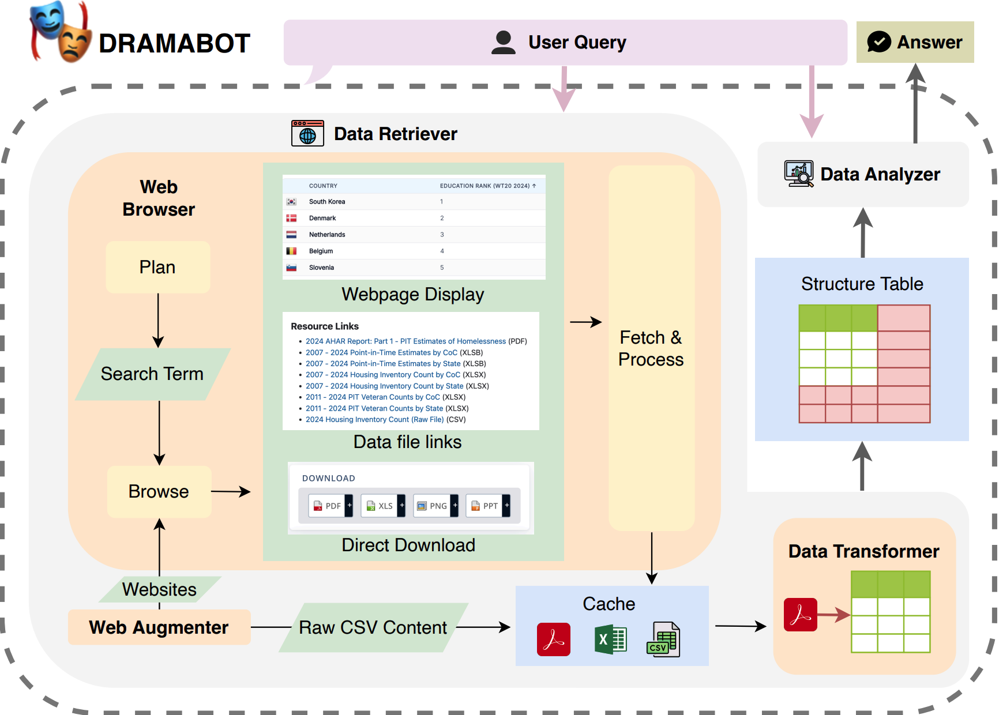

# 🎭 DramaBot

This directory contains the implementation of **DramaBot**, a multi-agent system developed following the **DRAMA** paradigm. DramaBot is designed to execute end-to-end data science discovery pipelines, supporting:

1. **Open-domain data collection**
2. **Structured data transformation**
3. **Analytic reasoning**




## 🧠 System Overview

DramaBot is composed of the following components:

- **`data_retriever.py`** — Orchestrates the data collection process and invokes three specialized sub-agents:
  - **Web Browser** (`subagents/web_browser.py`): navigates the web to extract relevant content
  - **Data Transformer** (`subagents/data_transformer.py`): converts raw web content into structured formats
  - **Web Augmenter** (`subagents/web_augmenter.py`): supplements missing or incomplete information
- **`data_analyzer.py`** — Performs structured reasoning on the retrieved and transformed data

Together, these components form an integrated system capable of handling real-world analytical queries.

## ⚙️ Environment Setups

### 1. install all dependencies using [Poetry](https://python-poetry.org/):

```bash
poetry install
```
### 2. Set OpenAI API Key

Get an [OpenAI API key](https://platform.openai.com/api-keys) and include the following in your `.env` file:

```env
OPENAI_API_KEY=your_openai-api-key
```

or set it directly in your environment:

```bash
export OPENAI_API_KEY=your-openai-api-key
```

## 🚀 Running DramaBench Tasks

Use the provided script to run DramaBot on DramaBench tasks:

```bash
./run_drama.sh [qa|verification]
```

Replace `[qa|verification]` with the desired task type. For example:

- Run **QA tasks**:
  ```bash
  ./run_drama.sh qa
  ```

- Run **Verification tasks**:
  ```bash
  ./run_drama.sh verification
  ```

You can also run individual tasks with more granular control:

```bash
poetry run run-drama \
  --model "gpt-4o-2024-11-20" \
  --id 1 \
  --task qa \
  --report_folder reports
```

## 📁 Result Collection

All execution outputs will be automatically saved in the `./reports` directory (or in the location specified by `--report_folder`) for further analysis and evaluation. Detailed agent traces are stored in the `./traces` directory.
